# 🔔 Push Notifications Implementation - Backend

## Overview

Implementazione completa del sistema di notifiche push per eventi TCG favoriti nel backend TCG Arena.

## 📋 Modifiche Implementate

### 1. UserController - Endpoint Favorite TCGs

**File:** `src/main/java/com/tcg/arena/controller/UserController.java`

#### Nuovi Endpoint

##### POST /api/users/favorite-tcgs
Aggiorna i TCG favoriti dell'utente per le notifiche eventi.

**Request Body:**
```json
{
  "favoriteTCGs": ["POKEMON", "MAGIC", "YUGIOH"]
}
```

**Response:**
```json
{
  "message": "Favorite TCGs updated successfully",
  "favoriteTCGs": ["POKEMON", "MAGIC", "YUGIOH"]
}
```

**Errori:**
- 401: Not authenticated
- 404: User not found

**Implementazione:**
- Converte array di TCG in stringa comma-separated
- Salva in `User.favoriteTCGTypesString`
- Logga attività utente
- Thread-safe con transazioni JPA

---

##### GET /api/users/favorite-tcgs
Recupera i TCG favoriti dell'utente corrente.

**Response:**
```json
{
  "favoriteTCGs": ["POKEMON", "MAGIC"]
}
```

**Errori:**
- 401: Not authenticated
- 404: User not found

---

### 2. CommunityEventController - Push Notifications

**File:** `src/main/java/com/tcg/arena/controller/CommunityEventController.java`

#### Modifiche alla Creazione Eventi

Quando viene creato un evento (`POST /api/community/events`):

1. ✅ Crea l'evento normalmente
2. ✅ Chiama `sendEventNotifications(event)`
3. ✅ Invia push a tutti gli utenti interessati
4. ✅ Ritorna response (non aspetta completamento notifiche)

#### Logica Invio Notifiche

```java
private void sendEventNotifications(CommunityEventDTO event) {
    // 1. Verifica che l'evento abbia un TCG type
    // 2. Trova utenti con quel TCG nei favoriti
    // 3. Filtra utenti con device token valido
    // 4. Invia push notification a ciascuno
    // 5. Gestisce token invalidi (li rimuove)
}
```

**Filtri Applicati:**
- ✅ TCG deve essere nei favoriti dell'utente
- ✅ Utente deve avere device token configurato
- ✅ Match case-insensitive (POKEMON = pokemon)

**Payload Push Notification:**
```json
{
  "notification": {
    "title": "🎉 Nuovo Evento Pokémon!",
    "body": "Torneo Commander - Game Store Milano"
  },
  "data": {
    "type": "new_event",
    "eventId": "123",
    "eventTitle": "Torneo Commander",
    "tcgType": "POKEMON"
  }
}
```

---

## 🗄️ Database Schema

### User Table - Campo Esistente

```sql
-- Campo già presente nel database
favoriteTCGTypesString VARCHAR(255)
-- Formato: "POKEMON,MAGIC,YUGIOH"
-- Separatore: virgola
-- Case: UPPERCASE (raccomandato)
```

**Esempi:**
```
"POKEMON"
"POKEMON,MAGIC"
"POKEMON,MAGIC,YUGIOH,ONEPIECE"
""  // Nessun favorito
NULL  // Non configurato (default: mostra tutto)
```

---

## 🔧 Configurazione Firebase

### Setup Richiesto

1. **File di Configurazione**
   - Posizionare `firebase-service-account.json` in:
     - `src/main/resources/` (raccomandato), oppure
     - Root del progetto, oppure
     - Path custom via env var `FIREBASE_SERVICE_ACCOUNT_PATH`

2. **Service Account Permissions**
   - Firebase Admin SDK Administrator
   - FCM v1 API abilitata su Google Cloud

3. **Verifica Configurazione**
   ```bash
   curl http://localhost:8080/api/notifications/verify
   ```

### Gestione Token Invalidi

Il sistema gestisce automaticamente token FCM invalidi:
```java
try {
    sendPushNotification(token, title, body, data);
} catch (InvalidTokenException e) {
    // Token rimosso automaticamente dal database
    user.setDeviceToken(null);
    userRepository.save(user);
}
```

---

## 📊 Flow Completo

### Scenario: Utente Riceve Notifica Evento

```mermaid
sequenceDiagram
    participant U as User (iOS)
    participant API as Backend API
    participant DB as Database
    participant FCM as Firebase FCM

    U->>API: POST /api/users/favorite-tcgs
    Note over U,API: { favoriteTCGs: ["POKEMON"] }
    API->>DB: Update User.favoriteTCGTypesString
    DB-->>API: OK
    API-->>U: 200 OK

    Note over API: Altro utente crea evento Pokemon

    API->>DB: Query users with POKEMON in favorites
    DB-->>API: List<User> with device tokens

    loop For each interested user
        API->>FCM: Send Push Notification
        FCM-->>U: Push ricevuto
        Note over U: Notifica: "🎉 Nuovo Evento Pokémon!"
    end
```



---

## 🧪 Testing

### 1. Test Endpoint Favorite TCGs

```bash
# Login e ottieni token
TOKEN="your_jwt_token"

# Imposta TCG favoriti
curl -X POST http://localhost:8080/api/users/favorite-tcgs \
  -H "Authorization: Bearer $TOKEN" \
  -H "Content-Type: application/json" \
  -d '{"favoriteTCGs": ["POKEMON", "MAGIC"]}'

# Verifica TCG favoriti
curl -X GET http://localhost:8080/api/users/favorite-tcgs \
  -H "Authorization: Bearer $TOKEN"
```

### 2. Test Push Notifications

```bash
# Configura device token (da iOS app)
# Poi crea un evento

curl -X POST http://localhost:8080/api/community/events \
  -H "Authorization: Bearer $TOKEN" \
  -H "Content-Type: application/json" \
  -d '{
    "title": "Torneo Pokemon Test",
    "tcgType": "POKEMON",
    "eventDate": "2026-01-20T18:00:00",
    "locationType": "CUSTOM",
    "customLocation": "Test Location",
    "maxParticipants": 8
  }'
```

**Verifica:**
1. Backend logs: `Found X users interested in POKEMON events`
2. Backend logs: `Sent event notification to user: username`
3. iOS app riceve notifica push

### 3. Test Token Invalidi

```bash
# Inserisci token fake nel database
UPDATE users SET device_token = 'invalid_token_123' WHERE id = 1;

# Crea evento - dovrebbe rimuovere automaticamente il token
```

**Verifica logs:**
```
🗑️ Invalid FCM token detected: invalid_token_123...
Invalid token for user test_user, clearing it
```

---

## 📝 Logging

### Eventi Loggati

**Favorite TCGs Update:**
```
[ActivityLog] User ID: 123
Type: USER_PREFERENCES_UPDATED
Description: Aggiornati TCG favoriti per notifiche: POKEMON, MAGIC
```

**Event Notifications:**
```
[EventController] Found 5 users interested in POKEMON events
[EventController] Sent event notification to user: mario_rossi
[EventController] Sent event notification to user: luigi_verdi
```

**Token Errors:**
```
[FirebaseService] 🗑️ Invalid FCM token detected: abc123...
[EventController] Invalid token for user mario_rossi, clearing it
```

---

## ⚠️ Note Importanti

### Performance

1. **Scalabilità**
   - Attualmente usa `findAll()` + filter
   - Per > 10k utenti, considerare query custom:
   ```sql
   SELECT * FROM users
   WHERE device_token IS NOT NULL
   AND (
     favorite_tcg_types_string LIKE '%POKEMON%' OR
     favorite_tcg_types_string = 'POKEMON' OR
     favorite_tcg_types_string LIKE 'POKEMON,%'
   )
   ```

2. **Async Processing**
   - Le notifiche sono inviate in modo sincrono
   - Per > 100 utenti, considerare `@Async` o message queue

### Sicurezza

1. **Rate Limiting**
   - Implementare rate limit su `/api/users/favorite-tcgs`
   - Max 10 richieste/minuto per utente

2. **Validation**
   - Validare TCG types contro enum predefinito
   - Sanitizzare input per prevenire injection

### Privacy

1. **GDPR Compliance**
   - Device token è Personal Data
   - Permettere cancellazione: `DELETE /api/users/device-token`
   - Log retention: 90 giorni

---

## 🚀 Deploy Checklist

- [ ] Firebase service account configurato
- [ ] FCM v1 API abilitata
- [ ] Environment variables configurate
- [ ] Database migration eseguita (campo già esiste)
- [ ] Logs configurati per monitoraggio
- [ ] Rate limiting implementato
- [ ] iOS app configurata per ricevere push
- [ ] Test end-to-end completati

---

## 📚 Riferimenti

- [Firebase Cloud Messaging](https://firebase.google.com/docs/cloud-messaging)
- [FCM HTTP v1 API](https://firebase.google.com/docs/reference/fcm/rest/v1/projects.messages)
- [iOS Push Notifications](https://developer.apple.com/documentation/usernotifications)

---

**Implementato da:** Claude Code
**Data:** 2026-01-09
**Versione Backend:** Spring Boot 3.x
**Firebase SDK:** Admin SDK Java
